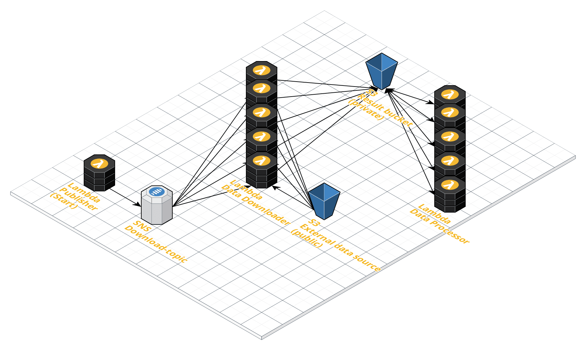

# Anomaly detection on ARIMA manifolds

This repository is a code playground for my master thesis at TU Berlin.
This means there is a lot of experimental code and copy/paste parts,
rather than a production ready perfect project right now.

## Autoencoder

Example of anomaly detection using generated timeseries data and autoencoder.
The example show results for different regularization values.

```console
python3 autoencoderExample.py | tee autoencoder/log.txt
```

## NYC Taxi Dataset

The dataset is downloaded from [Numenta](https://github.com/numenta/NAB/blob/master/data/realKnownCause/nyc_taxi.csv).  
The raw data is from the [NYC Taxi and Limousine Commission](https://www1.nyc.gov/site/tlc/about/tlc-trip-record-data.page).  
For other datasets please also see [The Numenta Anomaly Benchmark](https://github.com/numenta/NAB).

```console
python3 taxi_nyc.py | tee log_taxi.txt
```

### [Data processing pipeline](./aws_lambda_taxi_data/README.md)



## Yahoo S5 dataset

Please request and download dataset from [yahoo](https://webscope.sandbox.yahoo.com/catalog.php?datatype=s&did=70).

```console
python3 yahoo.py | tee log_yahoo.txt
```
