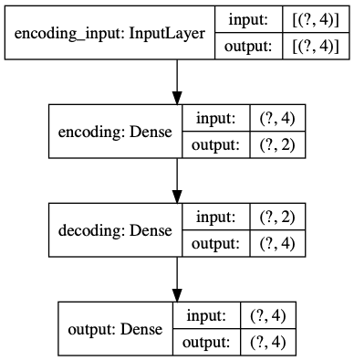
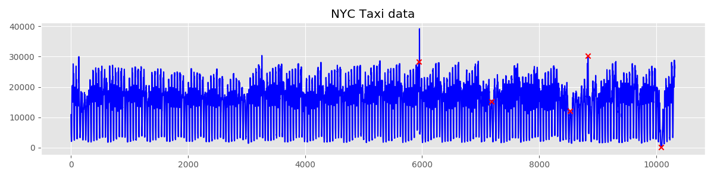
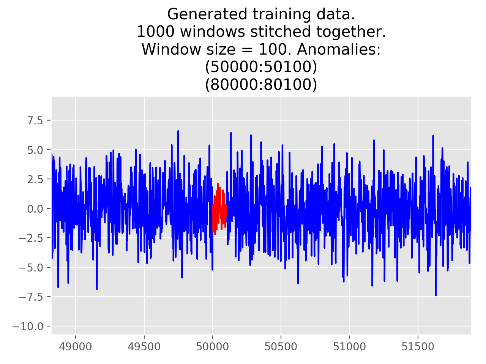

# Anomaly detection on ARIMA manifolds

This repository is a code playground for my master thesis at TU Berlin.  
The topic of my thesis is _Anomaly detection in ARIMA manifolds_.

## Autoencoder



Example of anomaly detection using generated timeseries data and autoencoder.
The example show results for different regularization values.

```console
python3 autoencoderExample.py | tee autoencoder/log.txt
```

## NYC Taxi Dataset



The dataset is downloaded from [Numenta](https://github.com/numenta/NAB/blob/master/data/realKnownCause/nyc_taxi.csv).  
The raw data is from the [NYC Taxi and Limousine Commission](https://www1.nyc.gov/site/tlc/about/tlc-trip-record-data.page).  
For other datasets please also see [The Numenta Anomaly Benchmark](https://github.com/numenta/NAB).

```console
python3 taxi_nyc_numenta_data.py | tee results/taxi_nyc_numenta_data/log_taxi.txt
```

Please find results in ./taxi_nyc_numenta_data.

### [Data processing pipeline](./aws_lambda_taxi_data/README.md)


## Yahoo S5 dataset

Please request and download dataset from [yahoo](https://webscope.sandbox.yahoo.com/catalog.php?datatype=s&did=70).

```console
python3 yahoo.py | tee log_yahoo.txt
```

## Generated times series



Two time series are generate from two ARMA models with different parameters.  
Then they are combined into one time series which contains anomalies.
On this time series we use moving windows and train fit an ARMA model on each  
window. The parameters of these fitted models are our features.  
Finally we use four algorithms to detect anomalies in that feature set  
(Robust covariance, One-Class SVM, Isolation Forest,Local Outlier Factor).
Please find results in ./results/generated

```console
python3 anomalyTester.py | tee results/generated/log.txt
```
