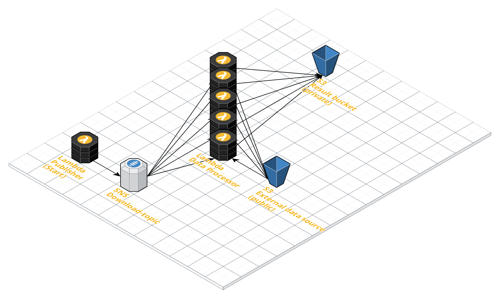

# AWS lambda data processor (External s3 bucket data)

Please read the [general desciption](../README.md) in the parent directory first.  

  
Invoced by SNS message containing the filename as Subject.  
The message itself is irrelevant in this case (only the subject is important).  

The data will be streamed directly from the external (public) s3 bucket.  
Result files (containing the 30 minute aggregations) are stored in your own  
AWS account (in your s3 bucket).
